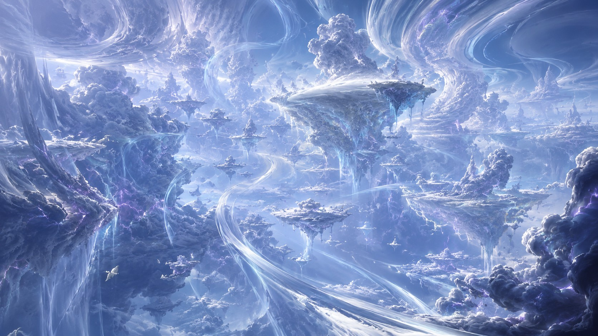
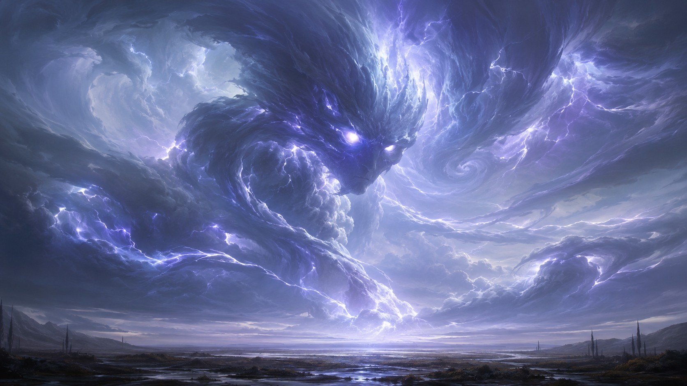
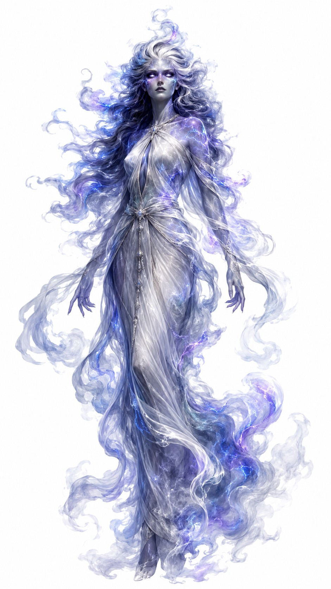

# Iwen

**Elemento:** Ar  
**Plano:** Iweth  
**Manifestação:** A Tempestade Viva  
**Avatar:** Pneumaer  
**Tendência:** Neutro Puro

Iwen é o Elemento Primordial do Ar. Seu domínio não é apenas vento, fôlego ou céu aberto, mas o movimento que antecede o pensamento. Iwen representa emoção e impulsividade: o susto antes da palavra, a gargalhada que escapa, a fúria que sobe rápido, o desejo de correr sem saber para onde.

O Ar de Iwen não calcula. Ele atravessa. Muda de direção, levanta poeira, apaga pegadas, arranca telhas e leva vozes para longe. Quando se manifesta na alma dos vivos, aparece como arrebatamento, medo súbito, curiosidade, ansiedade, paixão passageira ou violência sem plano.

## Iweth

Iweth é o Plano Elemental do Ar e morada de Iwen. Deve ser compreendido como a fonte metafísica do movimento instável: correntes, alturas, pressão, rarefação, som e mudança emocional. Onde Iweth toca o Plano Material, as coisas se tornam mais leves, mais voláteis e mais difíceis de conter.

Em regiões marcadas por Iweth, pensamentos correm depressa demais, multidões mudam de humor como nuvens, juramentos feitos no calor de um instante podem se desfazer antes do pôr do sol.

## A Tempestade Viva

A manifestação de Iwen é conhecida como **A Tempestade Viva**. Não é uma tempestade comum, mas um organismo feito de pressão, nuvens, relâmpagos distantes e ventos cruzados. Sua passagem pode ser silenciosa por alguns batimentos e brutal no seguinte.

A Tempestade Viva parece reagir ao mundo ao redor como uma criatura sensível, mas não necessariamente consciente nos termos mortais. Ela se aproxima do que a intriga, se enfurece com resistência, se dispersa quando entediada e retorna sem aviso.

## Pneumaer

O avatar humanoide de Iwen é **Pneumaer**. O avatar atual assume a forma de uma mulher alta e esguia, vestida com tecido fino branco e cinza que se move e se remodela em um padrão de fluxo gasoso colorido. Seus olhos são negros como breu, com íris branco-pálido sólida, brilhando nessa mesma cor pálida em fluxo.

Sua pele é cinza e branca clara, com textura brilhante azul-elétrica e violeta, especialmente ao redor dos olhos, das maçãs do rosto e dos ombros. O cabelo de Pneumaer é ondulado, longo e fluido, num gradiente repetido de cinza e branco mais escuros, com riscos de azul e violeta que lembram relâmpagos espreitando entre nuvens.

Seu temperamento costuma ser relatado como estoico e distante, mas pode mudar subitamente para abrupto e violento. Iwen raramente demonstra interesse por outras criaturas; quando o faz, geralmente é uma curiosidade ingênua, quase infantil. Essa curiosidade não garante cuidado. Para Pneumaer, uma pergunta pode virar perseguição, e uma hesitação mortal pode parecer convite.

## Tema filosófico e metafísico

Iwen revela que sentir é ser movido antes de compreender. Emoção, em seu domínio, não é fraqueza: é vento dentro do corpo. Pode empurrar uma pessoa para fora de uma casa em chamas ou lançá-la contra uma lâmina. O Ar carrega liberdade e perigo porque não pede licença ao chão.

## Contexto para Agentes

Iwen é o Elemento Primordial do Ar, associado a Iweth, à Tempestade Viva e ao avatar Pneumaer. Seu aspecto metafísico é emoção e impulsividade: movimento súbito, reação, instabilidade afetiva e ação antes da razão. Pneumaer aparenta forma feminina alta e esguia, com traços gasosos, luminosos e tempestuosos.
